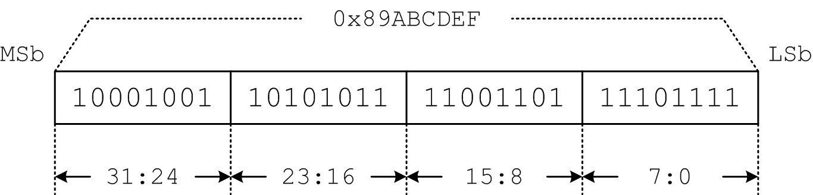
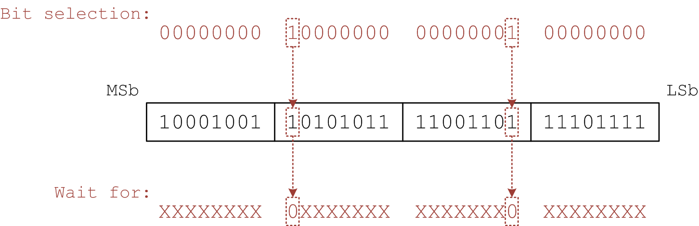
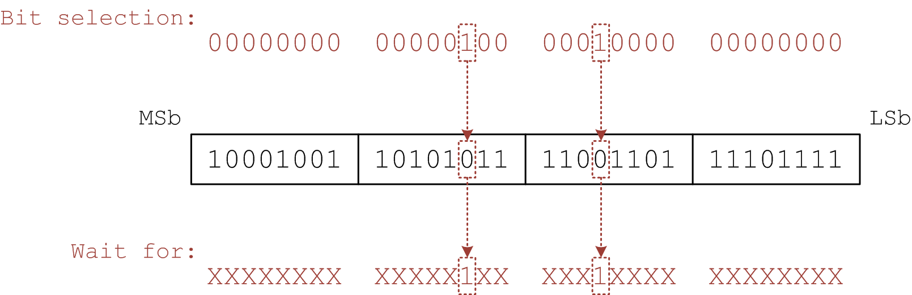
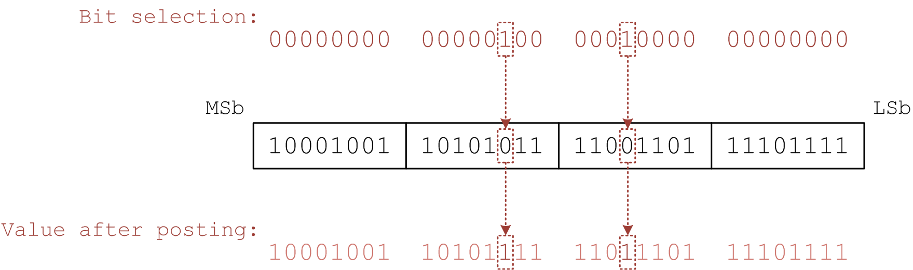
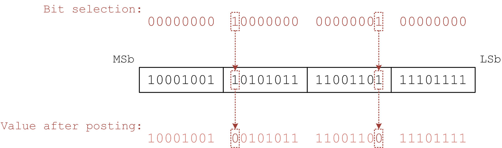
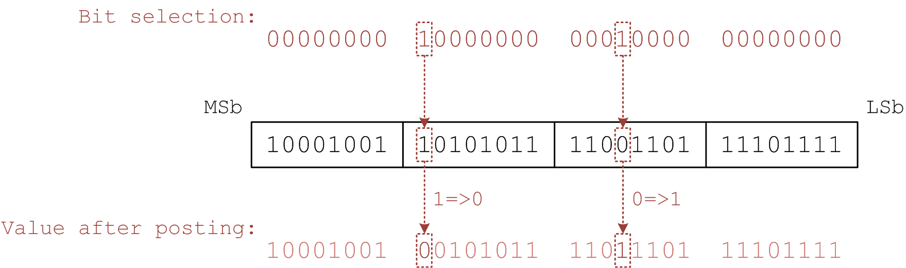

## Examples

### Event Flags

These examples will demostrate how to use *LwEventFlags* class. *LwEventFlags* internally maintains an unsigned 32-bit integer. Each bit of the integer represents an "event flag" and can be manipulated by your application (via *post()* method). Your application can also wait for one or more bits to be changed to specified state (via *pend()* method).

All of following examples are based on an *LwEventFlags* instance with initial value 0x89ABCDEF (i.e. 0b10001001 10101011 11001101 11101111):



```
let flags = new LwEventFlags(0x89ABCDEF);
```

#### Bit selection

To select one or more bits to *pend()* or *post()*, you have to use another unsigned 32-bit integer and set selected bits to 1 and clear unselected bits. For example, if bit 8 and 23, 0b00000000 10000000 00000001 00000000 (i.e. 0x00800100) is used.

#### Example 1 - 4: Pend on specified bits

##### Example 1: Pend with PENDOP_CLR_ALL

To wait for all selected bits to be cleared (0), call *pend()* method with *PENDOP_CLR_ALL*.

In this example, we would wait for both bit 8 and 23 to be cleared:



```
let bitselected = 0x00800100;
let wh = flags.pend(bitselected, LwEventFlags.PENDOP_CLR_ALL);
wh.handle.then(function() {
    console.log("Bit 8 and 23 are cleared.");
    console.log("Value when bits are cleared:" + wh.value.toString(16));
});
```

To test above example, let's clear bit 8 and 23 after 500 milliseconds.

```
setTimeout(function() {
    flags.post(bitselected, LwEventFlags.POSTOP_CLR);
}, 500);
```

##### Example 2: Pend with PENDOP_CLR_ANY

To wait for any of selected bits to be cleared (0), call *pend()* method with *PENDOP_CLR_ANY*.

Like example 1, with the same *bitselected*, *wh.handle* would resolve when either bit 8 or 23 clears:

```
let wh = flags.pend(bitselected, LwEventFlags.PENDOP_CLR_ANY);
wh.handle.then(function() {
    if ((wh.value & 0x00800000) == 0) {
        console.log("Bit 23 is cleared.");
    }
    if ((wh.value & 0x00000100) == 0) {
        console.log("Bit 8 is cleared.");
    }
});
```

To test above example, let's clear bit 23 after 500 milliseconds.

```
setTimeout(function() {
    flags.post(0x00800000, LwEventFlags.POSTOP_CLR);
}, 500);
```

Or clear bit 8 instead:

```
setTimeout(function() {
    flags.post(0x00000100, LwEventFlags.POSTOP_CLR);
}, 500);
```

##### Example 3: Pend with PENDOP_SET_ALL

To wait for all selected bits to be set (1), call *pend()* method with *PENDOP_SET_ALL*.

In this example, we would wait for both bit 12 and 18 to be set:



```
let bitselected = 0x00041000;
let wh = flags.pend(bitselected, LwEventFlags.PENDOP_SET_ALL);
wh.handle.then(function() {
    console.log("Bit 12 and 18 are set.");
    console.log("Value when bits are set:" + wh.value.toString(16));
});
```

To test above example, let's set bit 12 and 18 after 500 milliseconds.

```
setTimeout(function() {
    flags.post(bitselected, LwEventFlags.POSTOP_SET);
}, 500);
```

##### Example 4: Pend with PENDOP_SET_ANY

To wait for any of selected bits to be set (1), call *pend()* method with *PENDOP_SET_ANY*.

Like example 3, with the same *bitselected*, *wh.handle* would resolve when either bit 12 or 18 sets:

```
let wh = flags.pend(bitselected, LwEventFlags.PENDOP_SET_ANY);
wh.handle.then(function() {
    if ((wh.value & 0x00040000) == 0) {
        console.log("Bit 18 is set.");
    }
    if ((wh.value & 0x00001000) == 0) {
        console.log("Bit 12 is set.");
    }
});
```

To test above example, let's set bit 18 after 500 milliseconds.

```
setTimeout(function() {
    flags.post(0x00040000, LwEventFlags.POSTOP_SET);
}, 500);
```

Or set bit 12 instead:

```
setTimeout(function() {
    flags.post(0x00001000, LwEventFlags.POSTOP_SET);
}, 500);
```

#### Example 5 - 10: Modify(Post) specified bits

##### Example 5: Set specified bits with POSTOP_SET

See example 3 and 4. Following source code sets bit 12 and 18:

```
let bitselected = 0x00041000;
//...
flags.post(bitselected, LwEventFlags.POSTOP_SET);
//...
```



##### Example 6: Set specified bits via bitwise operation

*LwEventFlags.prototype.value* can be assigned directly. *Logic Or* (`|`) can be used to set specified bits:

```
let bitselection = 0xFFFFFFFF;
flags.value = ((flags.value | bitselection) >>> 0);
```

##### Example 7: Unset specified bits with POSTOP_CLR

See example 1 and 2. Following source code clears bit 8 and 23:

```
let bitselected = 0x00800100;
//...
flags.post(bitselected, LwEventFlags.POSTOP_CLR);
//...
```



##### Example 8: Unset specified bits via bitwise operation

Like example 6. *Logic And* (`&`) can be used to unset specified bits:

```
let bitselection = 0xFFFFFFFF;
flags.value = ((flags.value & (0xFFFFFFFF ^ bitselection)) >>> 0);
```

##### Example 9: Flip specified bits with POSTOP_FLIP

Flip a bit means that if the bit equals to 1, it would be set to 0. Otherwise, it would be set to 1.

Following source code flips bit 12 and 23:

```
let bitselection = 0x00801000;
flags.post(bitselection, LwEventFlags.POSTOP_FLIP);
```



##### Example 10: Flip specified bits via bitwise operation

Like example 6. *Exclusive Or* (`^`) can be used to flip specified bits:

```
let bitselection = 0x00801000;
flags.value = ((flags.value ^ bitselection) >>> 0);
```

#### Example 11: Pend synchronously

To pend on specified bits synchronously (i.e. without waiting), call the *pend()* method with *PENDFLAG_NOWAIT* flag.

In this example, a *LwEventFlags* with initial value 0x00000001 is used:

```
let flags = new LwEventFlags(0x00000001);
```

Let's keep the flag value unchanged, so that the LSb (Least significant bit) is always 1 and other bits are all 0.

In other word, if you *pend()* for the LSb to be set (already set) with *PENDFLAG_NOWAIT* flag, it would return a *LwEventFlags.WaitHandle* whose *status* is *LwEventFlags.WaitHandle.STATUS_SATISFIED*:

```
let wh = flags.pend(
    0x00000001, 
    LwEventFlags.PENDOP_SET_ALL, 
    LwEventFlags.PENDFLAG_NOWAIT
);
if (wh && wh.status == LwEventFlags.WaitHandle.STATUS_SATISFIED) {
    console.log("Test passed.");
}
```

However, if you change `0x00000001` to `0x00000002` or any other unsigned 32-bit integer with LSb equals to 0, `NULL` would be returned by *pend()*.

#### Example 12: Cancel waiting

The *cancel()* method (i.e. *cancel* property which is a *Function* instance) of a *LwEventFlags.WaitHandle* instance can be used to cancel waiting.

Use the *status* property of the *LwEventFlags.WaitHandle* instance to determine whether the *LwEventFlags.WaitHandle.prototype.handle* is resolved due to pending condition satisfied (or being cancelled).

To demostrate, create a *LwEventFlags* instance with initial value 0 and set the value to 1 at 500 milliseconds:

```
let flags = new LwEventFlags(0);
setTimeout(function() {
    flags.value = 1;
}, 500);
```

Pend on the LSb:

```
let wh = flags.pend(1, LwEventFlags.PENDOP_SET_ALL);
wh.handle.then(function() {
    if (wh.status == LwEventFlags.WaitHandle.STATUS_CANCELLED) {
        console.log("Operation cancelled.");
    }
});
```

Cancel the operation at 250 milliseconds (before we set the LSb to 1):

```
setTimeout(function() {
    wh.cancel();
}, 250);
```

Run the example, you will see `Operation cancelled` printed on the standard output.

#### Example 13: Consume affected bit(s)

If you *pend()* one or more bits with *PENDFLAG_CONSUME* flag, any bit or bits that make the wait handle resolve would be reset to its origin value, see following example:

```
let flags = new LwEventFlags(0);
setTimeout(function() {
    flags.value = 3;    //  0b11
}, 500);
let wh = flags.pend(1, LwEventFlags.PENDOP_SET_ALL, PENDFLAG_CONSUME);
wh.handle.then(function() {
    console.log(wh.value);    //  => 3 (0b11).
    console.log(flags.value); //  => 2 (0b10).
});
```

